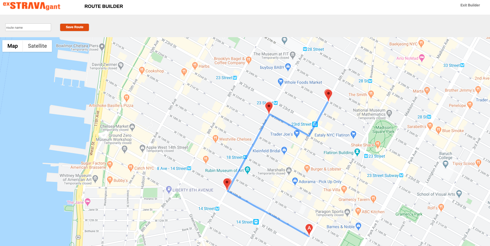

<p align="center">
   
</p>
                
<br/>
<br/>

[ExSTRAVAgant](https://exstravagant.herokuapp.com/#/) is a website for activities such as running and biking. ExSTRAVAgant has the capability to track manually entered workouts and have their respective statistics displaed in aggregate in order to track the user's progress. Additionally, a user has the ability to generate routes by using an interactive map.The map gives the user the freedom to  simply click on streets and a route will be automatically generated based on those points. 

The project was completed in 10 days with a plan to add additional features.

___

### Technologies

ExSTRAVAgant uses the following frameworks and libraries:
- Backend: Ruby on Rails
- Database: PostgreSQL 
- Frontend: JavaScript React-Redux frontend. 
 
 Addtional technologies used:
- Google Maps Directions API
- Google Maps JavaScript API

___

### Features

- Routes Index
- Create routes on a map
- Manually add workouts 

___

#### Create Routes
<p align="center">
   
</p>
<br/>
A location is pinned whenever a user clicks on the map. Based on the pinned locations, routes are created. 
<br/>
<br/>

```
addMarker(){

        const last = this.points[this.points.length - 1];
        const position = {
            lat: last.location.lat(),
            lng: last.location.lng()
        }
     
   
        this.marker = new google.maps.Marker({
            position: position
        });
        
        this.marker.setMap(this.map);

    }

    displayRoutes () {
        let midPoints = this.points.slice(1, this.points.length)
       
        console.log(midPoints);
       
        this.directionsService.route({
            origin: this.points[0].location,
            waypoints: midPoints.map(mark => ({ location: mark.location })),
            destination: this.points[this.points.length - 1].location,
            travelMode: 'WALKING'
        }, (response, status) => {
            if (status == 'OK') {
                this.directionsRenderer.setDirections(response);
            }
        })
    }
    
    listenForClick(){
        this.map.addListener('click', (e) => {
            this.addPoints(e.latLng);
            this.addMarker();
            this.displayRoutes();
        })
    }
```

<br/>
Used the event listener provided by the Google Maps API to keep track of where the user clicks so that markers could be placed on those respective positions.  
<br/>
<br/>

#### Routes Index

<p align="center">
   
</p>

<br/>
Once a route is created. All the routes created by the user are displayed along with a static image of their route for reference. 
<br/>
<br/>

### Create Workouts

<p align="center">
   
</p>
Manual workout entries can be created to track a user's progress.  
<br/>
<br/>

___

### Future Implementations
- Improve map interaction by adding edit, undo and clear routes functionality.
- Add individual shows pages for routes and workouts.
- Add comment functionality to the dashboard
